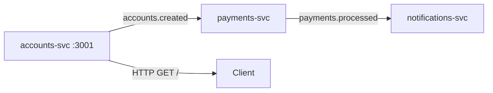

# 🏦 Kafka Banking Microservices

Mini projet bancaire avec **KafkaJS** et **Hono** - 3 microservices communiquant via Kafka en temps réel.

   

## 🏗️ Architecture



### 🔧 Services
- **🏢 accounts-svc** (port 3001): API REST Hono + producteur d'événements
- **💳 payments-svc**: Traitement des paiements en temps réel  
- **📱 notifications-svc**: Système de notifications push

## 🚀 Démarrage rapide

### Prérequis
- Node.js 18+ 
- Docker & Docker Compose
- npm ou yarn

### Installation

```bash
# 1. Cloner et installer
git clone <repo>
cd kafka-banking
npm install

# 2. Lancer l'infrastructure
npm run kafka:up

# 3. Attendre que Kafka soit prêt (10-15s) puis créer les topics
npm run topics

# 4. Démarrer les microservices
npm run dev:accounts        # Terminal 1 (API HTTP)
npm run dev:payments        # Terminal 2 (Consumer/Producer)  
npm run dev:notifications   # Terminal 3 (Consumer)
```

### ✅ Vérification

```bash
# Test de l'API
curl http://localhost:3001/
# → "hello world"

# Observer les logs en temps réel dans chaque terminal
# accounts-svc  : 📤 accounts → produced: account-X
# payments-svc  : 📥 payments ⬅ consumed: account-X → 📤 payment processed  
# notifications : 🔔 NOTIFICATION: Account account-X payment PAID
```

## 📊 Flux de données détaillé

### 1. Création de compte (accounts-svc)
```javascript
// Événement publié toutes les 3s
{
  "accountId": "account-1",
  "userId": "user-742", 
  "createdAt": "2024-01-15T10:30:00.000Z"
}
```

### 2. Traitement paiement (payments-svc)
```javascript
// Consomme accounts.created → publie payments.processed
{
  "accountId": "account-1",
  "status": "PAID",
  "processedAt": "2024-01-15T10:30:00.500Z"
}
```

### 3. Notification (notifications-svc)
```bash
🔔 NOTIFICATION: Account account-1 payment PAID at 2024-01-15T10:30:00.500Z
```

## 🛠️ Commandes disponibles

| Commande | Description |
|----------|-------------|
| `npm run dev:accounts` | Lance le service comptes (HTTP + Kafka) |
| `npm run dev:payments` | Lance le service paiements (Kafka only) |
| `npm run dev:notifications` | Lance le service notifications (Kafka only) |
| `npm run topics` | Crée les topics Kafka |
| `npm run kafka:up` | Démarre Kafka (Docker) |
| `npm run kafka:down` | Arrête Kafka et nettoie |

## 📋 Topics Kafka

| Topic | Partitions | Description |
|-------|------------|-------------|
| `accounts.created` | 3 | Nouveaux comptes créés |
| `payments.processed` | 3 | Paiements traités |

## 🐛 Troubleshooting

### 🔴 Kafka ne démarre pas
```bash
# Vérifier Docker
docker ps

# Nettoyer et relancer  
npm run kafka:down
docker system prune -f
npm run kafka:up
```

### 🔴 Erreurs de connexion "ENOTFOUND"
```bash
# Attendre que Kafka soit complètement démarré
sleep 15
npm run topics

# Vérifier les logs
docker logs kafka
```

### 🔴 Topics non créés / "This server does not host this topic-partition"
```bash
# Recréer les topics
npm run topics

# Vérifier manuellement
docker exec kafka kafka-topics.sh --bootstrap-server localhost:9092 --list
docker exec kafka kafka-topics.sh --bootstrap-server localhost:9092 --describe --topic accounts.created
```

### 🔴 Service accounts ne démarre pas
```bash
# Vérifier les dépendances
npm install

# Vérifier le port 3001
lsof -i :3001
```

## 🔍 Monitoring & Debug

### Vérifier les topics
```bash
# Lister tous les topics
docker exec kafka kafka-topics.sh --bootstrap-server localhost:9092 --list

# Consumer en ligne de commande pour debug
docker exec -it kafka kafka-console-consumer.sh \
  --bootstrap-server localhost:9092 \
  --topic accounts.created \
  --from-beginning
```

### Vérifier les consumer groups
```bash
docker exec kafka kafka-consumer-groups.sh \
  --bootstrap-server localhost:9092 \
  --list

docker exec kafka kafka-consumer-groups.sh \
  --bootstrap-server localhost:9092 \
  --describe --group payments-svc
```

## 📁 Structure du projet

```
kafka-banking/
├── 📄 docker-compose.yml      # Infrastructure Kafka
├── 📦 package.json           # Dependencies & scripts
├── 📋 README.md              # Documentation
├── 🔧 bootstrap/
│   └── create-topics.js      # Création topics Kafka
└── 🏢 services/
    ├── 🔧 shared/
    │   └── kafka.js          # Utilitaires Kafka partagés
    ├── 🏦 accounts/
    │   └── index.js          # Service comptes (Hono + Kafka)
    ├── 💳 payments/ 
    │   └── index.js          # Service paiements (Kafka only)
    └── 📱 notifications/
        └── index.js          # Service notifications (Kafka only)
```

## 🧪 Développement

### Variables d'environnement

Créer un fichier `.env` (optionnel) :
```env
KAFKA_BROKERS=localhost:9092
CLIENT_ID=banking-app
```

### Arrêt propre des services
Les services gèrent `SIGINT` et `SIGTERM` pour une déconnexion propre de Kafka.

```bash
# Ctrl+C dans chaque terminal pour un arrêt propre
```

## 🎯 Prochaines étapes

- [ ] Ajouter des tests unitaires (Jest)
- [ ] Implémenter un schema registry (Avro/JSON Schema)
- [ ] Ajouter des métriques (Prometheus)
- [ ] Dockeriser les microservices
- [ ] Ajouter une API Gateway
- [ ] Persistence en base de données

---

**🚀 Happy coding!** Pour toute question, vérifiez d'abord la section troubleshooting.