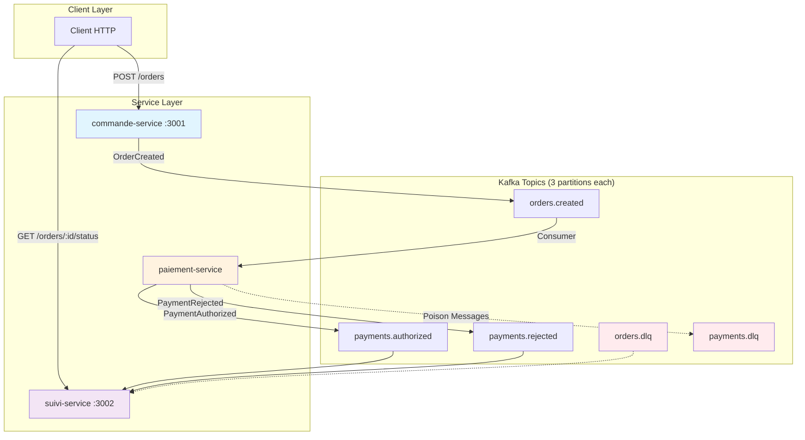

# 🏦 Kafka Event-Driven Microservices - Projet DevOps

**Système d'information événementiel** en Node.js/Hono démontrant l'asynchronisme via Apache Kafka entre microservices avec résilience, DLQ et tests d'intégration.

    

## 🏗️ Architecture Event-Driven



## 🎯 Fonctionnalités Implémentées

### ✅ Services Microservices
- **commande-service** : API REST POST `/orders` → publie `OrderCreated`
- **paiement-service** : Consomme `OrderCreated` → publie `PaymentAuthorized`/`PaymentRejected`
- **suivi-service** : Agrège les événements → API GET `/orders/{id}/status`

### ✅ Kafka Configuration Avancée
- **Topics partitionnés** (3 partitions avec clé = orderId)
- **Producteurs idempotents** (`acks=all`, `enable.idempotence=true`)
- **Consumers avec commit après traitement**
- **Dead Letter Queues (DLQ)** pour messages poison

### ✅ Résilience & Reliability
- **Retries avec backoff exponentiel**
- **Idempotence applicative** (déduplication par eventId)
- **Gestion des erreurs** avec circuit breaker
- **Monitoring des événements**

### ✅ Tests d'Intégration
- **Testcontainers** pour Kafka isolé
- **Tests bout-en-bout** du flux complet
- **Tests de déduplication** et résilience

## 📋 Schémas d'Événements

### OrderCreated
```json
{
  "eventId": "order-123-1640995200000",
  "orderId": "order-123", 
  "userId": "user-456",
  "amount": 99.99,
  "items": ["item1", "item2"],
  "status": "CREATED",
  "createdAt": "2024-01-15T10:30:00.000Z"
}
```

### PaymentAuthorized
```json
{
  "eventId": "payment-order-123-1640995201000",
  "orderId": "order-123",
  "userId": "user-456", 
  "amount": 99.99,
  "status": "AUTHORIZED",
  "authorizationCode": "AUTH-1640995201000",
  "processedAt": "2024-01-15T10:30:01.000Z"
}
```

### PaymentRejected
```json
{
  "eventId": "payment-order-124-1640995202000", 
  "orderId": "order-124",
  "userId": "user-789",
  "amount": 150.00,
  "status": "REJECTED", 
  "rejectionReason": "Insufficient funds",
  "processedAt": "2024-01-15T10:30:02.000Z"
}
```

## 🚀 Démarrage Rapide

### Prérequis
- **Node.js 18+**
- **Docker & Docker Compose** 
- **npm** ou **pnpm**

### Installation & Lancement

```bash
# 1. Installation des dépendances
npm install

# 2. Démarrer Kafka (mode KRaft, sans ZooKeeper)
npm run kafka:up

# 3. Attendre 10-15s puis créer les topics partitionnés
npm run topics

# 4. Lancer les microservices (3 terminaux séparés)
npm run dev:commande     # Terminal 1 - API REST :3001
npm run dev:paiement     # Terminal 2 - Consumer/Producer
npm run dev:suivi        # Terminal 3 - API Agrégation :3002
```

### 🧪 Tests & Validation

```bash
# Tests unitaires (résilience, déduplication)
npm test

# Tests d'intégration avec Testcontainers
npm run test:integration

# Test manuel du flux complet
curl -X POST http://localhost:3001/orders \
  -H "Content-Type: application/json" \
  -d '{
    "userId": "user-123",
    "amount": 99.99, 
    "items": ["laptop", "mouse"]
  }'

# Vérifier le statut (attendre 2-3s)
curl http://localhost:3002/orders/order-1/status
```

### 📊 Monitoring & Debug

```bash
# Vérifier les topics et partitions
docker exec kafka kafka-topics.sh --bootstrap-server localhost:9092 --list
docker exec kafka kafka-topics.sh --bootstrap-server localhost:9092 --describe --topic orders.created

# Consumer en ligne de commande pour debug
docker exec -it kafka kafka-console-consumer.sh \
  --bootstrap-server localhost:9092 \
  --topic orders.created \
  --from-beginning \
  --property print.headers=true

# Vérifier les consumer groups
docker exec kafka kafka-consumer-groups.sh \
  --bootstrap-server localhost:9092 \
  --describe --group paiement-svc

# Monitoring des DLQ
docker exec -it kafka kafka-console-consumer.sh \
  --bootstrap-server localhost:9092 \
  --topic payments.dlq \
  --from-beginning
```

## 📁 Structure du Projet

```
kafka-microservices/
├── 📁 services/
│   ├── 🏢 commande/index.js        # Service commandes (POST /orders)
│   ├── 💳 paiement/index.js        # Service paiements (Kafka only)
│   ├── 📊 suivi/index.js           # Service suivi (GET /orders/:id/status)
│   └── 🔧 shared/
│       ├── kafka.js                # Configuration Kafka idempotente
│       ├── dlq.js                  # Dead Letter Queue utils
│       └── resilience.js           # Backoff, déduplication, retry
├── 🧪 tests/
│   ├── integration.test.js         # Tests Testcontainers
│   └── unit.test.js                # Tests unitaires résilience
├── 🐳 bootstrap/create-topics.js   # Création topics partitionnés
├── 🐋 docker-compose.yml           # Kafka KRaft (sans ZooKeeper)
└── 📋 README.md                    # Documentation complète
```

## 🎛️ Configuration Kafka Production

### Topics Configuration
- **3 partitions** par topic (clé = orderId)
- **Retention : 7 jours** (données business)
- **DLQ Retention : 30 jours** (debug)
- **Cleanup policy : delete**

### Producer Settings
```javascript
{
  maxInFlightRequests: 1,
  idempotent: true,
  acks: 'all',           // Durabilité garantie
  retries: 5,
  retry: {
    initialRetryTime: 100,
    maxRetryTime: 30000
  }
}
```

### Consumer Settings
```javascript
{
  groupId: 'service-name',
  sessionTimeout: 30000,
  heartbeatInterval: 3000,
  allowAutoTopicCreation: false
}
```

## 🔧 APIs Disponibles

### Commande Service (:3001)
- `POST /orders` - Créer une commande
- `GET /` - Health check

### Suivi Service (:3002) 
- `GET /orders/:orderId/status` - Statut agrégé d'une commande
- `GET /orders` - Liste toutes les commandes
- `GET /` - Health check

### Exemples de Réponses

**POST /orders** (201 Created)
```json
{
  "orderId": "order-1",
  "eventId": "order-1-1640995200000", 
  "status": "created",
  "message": "Order created successfully"
}
```

**GET /orders/order-1/status** (200 OK)
```json
{
  "orderId": "order-1",
  "status": "PAYMENT_AUTHORIZED",
  "details": {
    "userId": "user-123",
    "amount": 99.99,
    "items": ["laptop", "mouse"],
    "createdAt": "2024-01-15T10:30:00.000Z",
    "paymentStatus": "AUTHORIZED", 
    "authorizationCode": "AUTH-1640995201000",
    "authorizedAt": "2024-01-15T10:30:01.000Z"
  },
  "events": [
    {"type": "OrderCreated", "timestamp": "2024-01-15T10:30:00.000Z"},
    {"type": "PaymentAuthorized", "timestamp": "2024-01-15T10:30:01.000Z"}
  ],
  "lastUpdated": "2024-01-15T10:30:01.000Z"
}
```

## 🛠️ Commandes Utiles

| Commande | Description |
|----------|-------------|
| `npm run dev:commande` | Lance commande-service (HTTP :3001) |
| `npm run dev:paiement` | Lance paiement-service (Kafka consumer) |
| `npm run dev:suivi` | Lance suivi-service (HTTP :3002 + Kafka) |
| `npm run topics` | Crée topics Kafka partitionnés |
| `npm run kafka:up` | Démarre Kafka (Docker) |
| `npm run kafka:down` | Arrête Kafka et nettoie |
| `npm test` | Tests unitaires |
| `npm run test:integration` | Tests avec Testcontainers |

## 🔍 Troubleshooting

### Kafka ne démarre pas
```bash
npm run kafka:down
docker system prune -f  
npm run kafka:up
```

### Topics non créés
```bash
# Attendre 15s puis recréer
sleep 15 && npm run topics
```

### Messages en DLQ
```bash
# Voir les messages poison
docker exec -it kafka kafka-console-consumer.sh \
  --bootstrap-server localhost:9092 \
  --topic payments.dlq \
  --from-beginning \
  --property print.headers=true
```

### Tests d'intégration échouent
```bash
# S'assurer que Docker fonctionne
docker version

# Nettoyer les containers
docker container prune -f
```

## 📈 Métriques & Observabilité

Le système trace automatiquement :
- **Déduplication** : Cache TTL des eventId
- **Retries** : Tentatives avec backoff exponentiel  
- **DLQ** : Messages poison avec raison d'échec
- **Partitioning** : Distribution par orderId
- **Consumer lag** : Via consumer groups

## 🎯 Prochaines Étapes (Roadmap)

- [ ] **Schema Registry** (Avro/JSON Schema)
- [ ] **Prometheus Metrics** (métriques business) 
- [ ] **Kubernetes Deployment** (Helm charts)
- [ ] **CQRS Event Store** (PostgreSQL)
- [ ] **Saga Pattern** (orchestration complexe)
- [ ] **OpenTelemetry** (tracing distribué)

---

**🚀 Projet DevOps complet** - Événementiel, Résilient, Testé et Monitoré !

Pour toute question, vérifier d'abord la section troubleshooting ou consulter les logs des services.